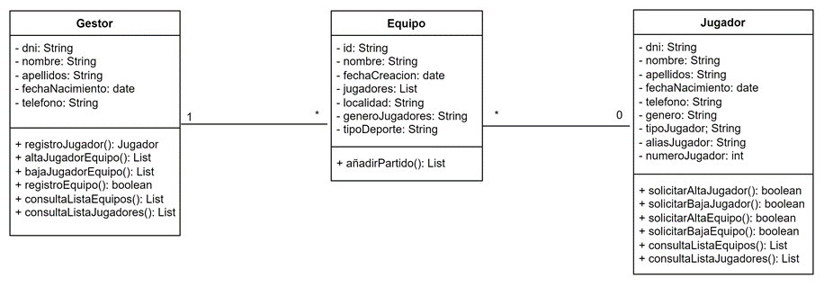

# 🎮 Gestión Proyecto eSport

---

## 📌 1. Análisis del problema y requisitos del sistema

En este sistema podemos identificar dos tipos de actores:

👤 **Gestor:**  
Tiene acceso completo para registrar, modificar y eliminar jugadores y equipos. Además, puede consultar la lista de equipos y jugadores.

🧑‍💻 **Jugador:**  
Sólo puede consultar la lista de jugadores y equipos y solicitar su alta o baja en el sistema o en un equipo. No puede modificar directamente los datos.

📝 **Interpretación del funcionamiento:**  
Mi forma de interpretar esta parte de la aplicación es que el Jugador puede solicitar el alta o la baja como jugador en el sistema, lo que deberá ser validado para posteriormente ser gestionado por el gestor correspondiente.  
El jugador también puede consultar la lista de equipos y jugadores para solicitar su alta o baja en un equipo. Estas solicitudes deben pasar obligatoriamente por una validación de requisitos y en el caso de que esa validación sea positiva, el gestor se encarga de registrar al jugador y darle de alta o baja en un equipo.  
Aparte, el gestor se encarga de registrar los equipos y para todo ello también puede consultar la lista de equipos y jugadores, desde la que opcionalmente se puede acceder a los detalles de jugadores y equipos.

---

## 📊 2. Diagrama de Casos de Uso

---

## 🧩 3. Diagrama de Clases

📐 **Relaciones entre clases:**

- 🧑‍🤝‍🧑 Un **equipo** tiene muchos **jugadores**, y un **jugador** puede estar en un equipo o en ninguno.  
- 🧑‍💼 Un **gestor** puede administrar un equipo o muchos, y un **equipo** puede estar administrado por un solo **gestor**.

---

## 🧠 4. Conclusiones

Este proyecto me ha ayudado a comprender mejor la estructura y funcionalidad del lenguaje UML, una herramienta muy útil para representar gráficamente el sistema y mejorar la visualización de la estructura interna y la relación entre los elementos.

---
